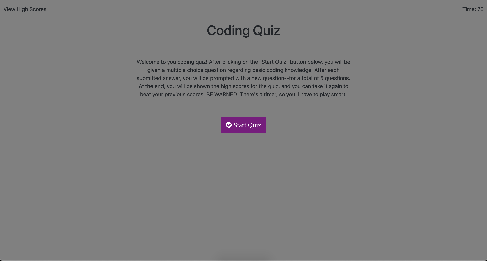

# JavaScript Quiz

## Table of Contents
* [Description](#description)
* [Technologies Used](#technologies-used)
* [Initial Usage](#initial-usage)
* [Application Demo](#application-demo)
* [Deployed Application Link](#deployed-application-link)
* [Contact Me](#contact-information)

## Description
This is a timed quiz in which--upon clicking "Start Quiz"--the user will be presented with 5 multiple choice questions, appearing successively. Upon completion, the user will be presented with a high score and the ability to add his/her name to the high scores, which will all be stored in the browser's local memory for access later and the option to try and "beat" previous high scores.

## Technologies Used
HTML, CSS, JavaScript

## Initial Usage
***THIS APPLICATION STILL NEEDS TO BE COMPLETED***

## Application Demo

## Deployed Application Link
* [Test your skills here!](https://jtbataille.github.io/JSQuizHW4/)

## Contact Information
* Jarrod Bataille
  * Portfolio Webpage: https://jtbataille.github.io/
  * GitHub Profile: https://github.com/jtbataille
  * E-mail Address: jtbataille@gmail.com